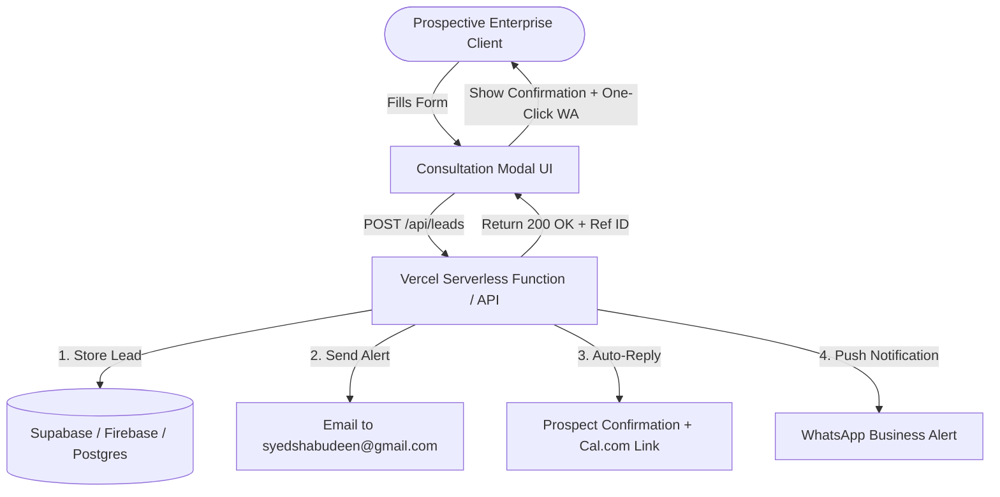

# Meeqat Technologies — Comprehensive App Audit & Revamp Master Report

**Document Version:** 1.0.0  
**Application Name:** Meeqat Technologies Enterprise IT Consulting Website  
**Repository Path:** `meeqat-digital-website`  
**Current Tech Stack:** React 18, Vite 5, Tailwind CSS 3, Lucide Icons, Vercel  
**Primary Domains & Scope:** Cloud Architecture (AWS / Azure / GCP), DevOps & CI/CD Automation, 24/7 Infrastructure Maintenance & SRE, Cybersecurity, Custom Web/Mobile Development  
**Geographic Footprint:** Regional Engineering Hubs (Tindivanam & Krishnagiri, Tamil Nadu; Pondicherry), Pan-India Metro Tech Corridors, Middle East (GCC), Worldwide  

---

## Table of Contents
1. [Executive Summary & App Health Scorecard](#1-executive-summary--app-health-scorecard)
2. [Current Technology Stack & Infrastructure](#2-current-technology-stack--infrastructure)
3. [Comprehensive Component Inventory & Audit](#3-comprehensive-component-inventory--audit)
4. [Critical Gap Analysis (Why a Revamp is Needed)](#4-critical-gap-analysis-why-a-revamp-is-needed)
5. [Strategic UI/UX & Design Revamp Recommendations](#5-strategic-uiux--design-revamp-recommendations)
6. [Functional & Technical Architecture Revamp Blueprint](#6-functional--technical-architecture-revamp-blueprint)
7. [SEO, GEO (Generative Engine Optimization) & Performance Strategy](#7-seo-geo-generative-engine-optimization--performance-strategy)
8. [Prioritized 4-Phase Implementation Roadmap](#8-prioritized-4-phase-implementation-roadmap)
9. [Component-by-Component Revamp Action Matrix](#9-component-by-component-revamp-action-matrix)

---

## 1. Executive Summary & App Health Scorecard

### 1.1 Overview
The **Meeqat Technologies** application is currently a single-page marketing and consultation web app. It is designed to position Meeqat Technologies as a high-end enterprise IT advisory firm, DevOps consultancy, and managed infrastructure provider.

The site is built with modern aesthetic intentions—featuring a dark `slate-950` palette, cyan/indigo glowing accents, glassmorphic panels, and technical telemetry mockups. However, to scale client acquisition, compete with top-tier global IT consultancies (such as ThoughtWorks, Slalom, or regional leaders in India & the Middle East), and support high-intent conversions, the application requires an architectural, functional, and content revamp.

### 1.2 Holistic Health Scorecard

| Evaluation Dimension | Current Score (out of 10) | Status | Key Observation |
| :--- | :---: | :---: | :--- |
| **Visual Aesthetics & Styling** | 8.5 / 10 | 🟢 Strong | Sleek dark mode, cyan/indigo gradients, glassmorphism, responsive grid. |
| **Code Structure & Modularity** | 8.0 / 10 | 🟢 Clean | Well-isolated React components in `src/components/`, zero console errors, clean Vite build. |
| **Lead Generation & Backend** | 3.5 / 10 | 🔴 Critical Risk | Form submission in `ConsultationModal.jsx` is simulated via `setTimeout` without real database/API persistence. Leads can be lost! |
| **Information Architecture / Routing**| 4.5 / 10 | 🟡 Limited | Pure Single-Page Application (SPA) using hash anchors (`#services`, `#industries`). No dedicated deep URLs for individual services or case studies. |
| **Asset & Image Optimization** | 5.0 / 10 | 🟡 Moderate | Brand logo image in `public/assets/` is **801 KB**, which hurts initial mobile LCP. |
| **SEO & Discoverability** | 6.5 / 10 | 🟡 Good Basics | Includes JSON-LD (`ITConsultant` & `FAQPage`), but lacks `robots.txt`, dynamic `sitemap.xml`, OpenGraph/Twitter social cards, and sub-pages. |
| **Social Proof & Trust Indicators** | 5.5 / 10 | 🟡 Moderate | Case studies use generic company pseudonyms without client logos, testimonials, or founder/team verification. |
| **Interactive Client Engagement** | 5.0 / 10 | 🟡 Basic | Static copy; lacks interactive ROI/FinOps cost calculators, cloud architecture planners, or live AI advisory bots. |

---

## 2. Current Technology Stack & Infrastructure

```
┌────────────────────────────────────────────────────────────────────────┐
│                        MEEQAT TECHNOLOGIES STACK                       │
├───────────────────┬────────────────────────────────────────────────────┤
│ Layer             │ Current Technology                                 │
├───────────────────┼────────────────────────────────────────────────────┤
│ Runtime / Build   │ Node.js (ES Modules) + Vite v5.4.10 / v5.4.21      │
│ UI Framework      │ React v18.3.1 + ReactDOM v18.3.1                   │
│ Styling           │ Tailwind CSS v3.4.14 + PostCSS v8.4.47             │
│ Icon Library      │ Lucide React v0.453.0 (Tree-shaken SVGs)           │
│ Typography        │ Google Fonts: Inter (Sans) + JetBrains Mono (Code) │
│ Deployment Host   │ Vercel (Configured via vercel.json)                │
│ Routing           │ Client-side HTML5 Smooth Hash Anchors              │
│ State Management  │ React useState / useEffect Local Hooks             │
└───────────────────┴────────────────────────────────────────────────────┘
```

### 2.1 File & Directory Footprint
- **Total Production Bundle Size:** ~235 kB JS (66.7 kB gzip), ~36.7 kB CSS (6.9 kB gzip).
- **Core Files:**
  - `index.html`: Entry HTML with SEO tags and Schema.org JSON-LD.
  - `src/App.jsx`: Master layout connecting the navbar, main sections, footer, and consultation modal.
  - `src/index.css`: Tailwind base directives, custom `.glass-panel`, `.glass-panel-glow`, `.bg-grid-pattern`.
  - `src/components/`: 10 modular React components.
  - `public/assets/`: 4 brand PNGs (including `meeqat-brand-logo.png` [801 KB], `meeqat-emblem.png` [74 KB]).
  - `vercel.json`: Handles SPA fallback rewrite (`/(.*) -> /index.html`) and asset cache headers.
  - `archive_legacy/`: Historical static HTML/CSS files preserved from prior iterations.

---

## 3. Comprehensive Component Inventory & Audit

### 3.1 `index.html` (SEO, Schemas, Metadata)
* **What it does:** Hosts the application root, connects Google Fonts (`Inter` and `JetBrains Mono`), and provides two structured data JSON-LD scripts:
  1. `ITConsultant` schema with multi-location addresses (Tindivanam & Krishnagiri), phone (`+919629047680`), email (`syedshabudeen@gmail.com`), and service areas (`Pondicherry`, `Tindivanam`, `Krishnagiri`, `Pan-India`, `Middle East`, `Worldwide`).
  2. `FAQPage` schema featuring 4 search-intent questions for AI search engines (ChatGPT Search, Perplexity, Gemini) and Google rich snippets.
* **Audit Assessment:**
  - ✅ Excellent local business and FAQ schema integration.
  - ⚠️ Missing Open Graph (`og:title`, `og:description`, `og:image`, `og:url`) and Twitter Card metadata for rich previews on LinkedIn, WhatsApp, and Twitter.
  - ⚠️ Missing canonical tag (`<link rel="canonical" href="https://meeqattechnology.com" />`).

### 3.2 `src/App.jsx` (Master Layout Controller)
* **What it does:** Coordinates modal state (`modalOpen`, `selectedService`, `selectedIndustry`), renders navigation, hero, metrics, services, industries, case studies, why us, FAQ, footer, and the popup modal.
* **Audit Assessment:**
  - ✅ Clean single-page composition; passes down opening triggers smoothly.
  - ⚠️ All content is rendered simultaneously on one page. As more content or case studies are added, initial DOM size will expand unless route code-splitting or lazy loading is introduced.

### 3.3 `src/components/Navbar.jsx` (Navigation & Sticky Header)
* **What it does:** Dynamic background blur on scroll (`scrollY > 20`), responsive mobile drawer, brand logo with pulsing indicator, 6 section links, direct WhatsApp telephone desk badge (`+91 9629047680`), and "Book Consultation" CTA.
* **Audit Assessment:**
  - ✅ Crisp, modern header with excellent responsive collapse.
  - ⚠️ Navigation uses smooth hash jumps (`#services`, `#industries`). If a user visits from an external link or subpage, these will break without a router.
  - ⚠️ No language selector (e.g., English / Arabic / Tamil) for international Middle East or South India clients.

### 3.4 `src/components/Hero.jsx` (High-Impact Value Proposition)
* **What it does:** Features a high-converting headline ("Architecting Resilient Cloud Systems, DevOps Pipelines & Scalable Software"), trust badges (AWS, Azure, GCP, Kubernetes CNCF, ISO 27001, 99.99% SLA), and an interactive **Live Infrastructure Telemetry Mockup** (`meeqat-infra-control.prod`) showing multi-region clusters, GitOps deployment status, 16ms latency, and -42.4% FinOps savings.
* **Audit Assessment:**
  - ✅ High visual impact; immediately communicates enterprise capability and technical depth.
  - ⚠️ The telemetry card is static/hardcoded; adding subtle animated metric counters or live mock pulses (e.g. simulated requests/sec or ping ticker) would elevate credibility.

### 3.5 `src/components/MetricsBar.jsx` (Enterprise Benchmarks)
* **What it does:** Highlights 4 core SLAs: `99.99%` Guaranteed Uptime SLA, `45%+` Cloud Cost Reduction, `250+` Delivered Projects, and `<15 min` Critical Incident MTTR.
* **Audit Assessment:**
  - ✅ Clear, quantifiable, and confidence-building.
  - ⚠️ Numbers are static; would benefit from a scroll-triggered number increment counter (e.g., 0 to 250+).

### 3.6 `src/components/Services.jsx` (8 Core Services & Geographic Coverage)
* **What it does:** Categorized filter tabs (`All`, `Cloud & Infra`, `Software & Mobile`, `Security & Support`, `Commerce & Growth`) displaying 8 core service cards. Each card includes category tags, descriptions, capabilities checklists, tech stack badges, and direct consultation CTA. Also showcases a 3-tier geographic delivery banner (Regional Tech Hubs, Pan-India Coverage, Worldwide & Middle East).
* **Audit Assessment:**
  - ✅ Comprehensive coverage of modern IT demands.
  - ⚠️ "Request Consultation" opens the general modal prefilled with the service name, but there is no dedicated landing page where clients can read full architecture specs, deliverables, or sample deliverables.

### 3.7 `src/components/Industries.jsx` (7 Vertical Domains)
* **What it does:** Highlights industry-specific solutions for Retail/E-commerce, Healthcare (HIPAA), Education/EdTech, Finance/Banking (PCI-DSS), Manufacturing/IoT, Hospitality, and Startups/SMEs.
* **Audit Assessment:**
  - ✅ Strong domain alignment; addresses enterprise compliance needs.
  - ⚠️ Could be expanded with downloadable compliance checklists or whitepapers (e.g., "HIPAA Cloud Migration Guide").

### 3.8 `src/components/CaseStudies.jsx` (Client Success Stories)
* **What it does:** Interactive tab switcher featuring 3 detailed case studies:
  1. *Global FinTech Payment Gateway* (AWS EKS, Aurora, 0s downtime cutover, -44% cost).
  2. *MedCloud Health Diagnostics* (Kubernetes, HashiCorp Vault, 18-min deploy cycle).
  3. *OmniChannel Retail Brand* (Next.js, Redis, 12x traffic surge, 0.8s LCP).
* **Audit Assessment:**
  - ✅ Well-structured problem/solution/outcomes format.
  - ⚠️ Uses anonymous client descriptions. Lacks verifiable logos, client testimonial quotes, or downloadable PDF case briefs.

### 3.9 `src/components/WhyUs.jsx` (Enterprise Advantages & SLA Guarantee)
* **What it does:** 6 value propositions (100% IaC, 15-Min SLA, Cloud-Agnostic, Zero-Trust Security, Direct Senior Architect Access, FinOps Cost Discipline) plus an SLA Money-Back Credit Commitment Banner.
* **Audit Assessment:**
  - ✅ Addresses typical enterprise fears (lock-in, slow response, junior staff, high costs).
  - ⚠️ The "Review SLA Agreement" button opens the consultation modal rather than displaying an actual SLA framework breakdown.

### 3.10 `src/components/FAQ.jsx` (Accordion & Search Optimization)
* **What it does:** 4 detailed expandable accordion cards covering regional leadership, tech stacks, infrastructure maintenance/cybersecurity, and international Middle East delivery.
* **Audit Assessment:**
  - ✅ Directly synchronizes with Google's `FAQPage` schema.
  - ⚠️ 4 questions is a solid start, but expanding to 8-10 questions (covering engagement pricing, support tiers, contract terms, security certifications) will capture more search long-tail queries.

### 3.11 `src/components/Footer.jsx` (Enterprise Footer & Physical Presence)
* **What it does:** Complete company footprint, direct email (`syedshabudeen@gmail.com`), phone/WhatsApp (`+91 9629047680`), two verified physical office cards with one-click Google Maps driving direction deep-links:
  - **Tindivanam Office:** No 48 Sentamizh Nagar, 4th Street, Tindivanam - 604001.
  - **Krishnagiri Office:** Rajaji Nagar 4th Cross, Krishnagiri - 635001.
  Plus services sitemap and compliance badges.
* **Audit Assessment:**
  - ✅ Excellent local SEO authority and physical verification.
  - ⚠️ Missing legal links: Privacy Policy, Terms of Service, Security Policy, and Cookie preferences.

### 3.12 `src/components/ConsultationModal.jsx` (Lead Capture Engine)
* **What it does:** Interactive modal with Esc key support, body scroll locking, fields for Name, Work Email, Phone/WhatsApp, Company, Service, Industry, Cloud Platform, Timeline, and Requirements. Generates a simulated booking reference (`MQ-XXXX-ENT`) and provides an immediate WhatsApp link pre-filled with form details.
* **Audit Assessment:**
  - 🔴 **CRITICAL VULNERABILITY:** The submission handler does not send the lead to any backend, email service, or database! It purely executes a `setTimeout` and updates local state. If a client submits their details and closes the tab without clicking the WhatsApp button, **the lead is completely lost**.

---

## 4. Critical Gap Analysis (Why a Revamp is Needed)

```
┌────────────────────────────────────────────────────────────────────────┐
│                      CORE GAPS IDENTIFIED IN AUDIT                     │
├───────────────────┬────────────────────────────────────────────────────┤
│ 1. Lead Leakage   │ No real backend/webhook transmission for forms.    │
│ 2. Single-Page    │ No indexable URLs for /services/* or /case-studies │
│ 3. Heavy Image    │ meeqat-brand-logo.png is 801 KB (unoptimized).     │
│ 4. Missing SEO    │ No robots.txt, sitemap.xml, or OpenGraph cards.    │
│ 5. Anonymity      │ No founder/team bios, photo proof, or logos.       │
│ 6. Static Nature  │ No interactive FinOps calculator or architecture   │
│                   │ configuration estimator.                           │
└───────────────────┴────────────────────────────────────────────────────┘
```

### Gap 1: Lead Capture & Conversion Vulnerability (High Priority)
* **The Issue:** `ConsultationModal.jsx` has no persistence layer. It simulates a successful API request after 1.2 seconds.
* **Business Impact:** High-value enterprise leads who fill out the form but don't click "WhatsApp Connect" vanish with zero record.
* **Revamp Solution:** Connect the form to a serverless backend endpoint (Vercel Serverless Function or Supabase / Resend / Formspree / SendGrid / Google Sheets Webhook). Automatically trigger:
  1. An email notification to `syedshabudeen@gmail.com` with the lead's exact requirements.
  2. An automated branded confirmation email to the prospect with an architecture meeting calendar link (Cal.com or Calendly).
  3. A persistent database record in a leads table.

### Gap 2: Architecture & Routing Limitations (Medium-High Priority)
* **The Issue:** The entire website exists at a single URL (`/`).
* **Business Impact:**
  - Enterprise prospects searching for specific queries like *"AWS Cloud Migration Consultant Tindivanam"* or *"Kubernetes DevOps consulting Chennai Pondicherry"* cannot be landed on a dedicated, keyword-rich service landing page.
  - Case studies cannot be shared as standalone URLs in proposals or pitch decks.
* **Revamp Solution:** Introduce client-side or file-system routing (e.g. Next.js App Router or React Router v6) to create dedicated routes:
  - `/services/cloud-migrations`
  - `/services/cybersecurity-consulting`
  - `/services/devops-infrastructure`
  - `/case-studies/fintech-payment-gateway`
  - `/contact` & `/about`

### Gap 3: Asset Weight & Web Performance (Medium Priority)
* **The Issue:** `public/assets/meeqat-brand-logo.png` is **801,734 bytes (801 KB)**.
* **Business Impact:** Slower initial page load and degraded Largest Contentful Paint (LCP) score on 4G mobile connections.
* **Revamp Solution:** Convert all PNGs to modern WebP / AVIF formats, reduce dimensions to exact viewport requirements, or implement an SVG vector logo. Expected size reduction: 801 KB down to ~25 KB (96% bandwidth savings).

### Gap 4: Missing SEO & Social Sharing Infrastructure (Medium Priority)
* **The Issue:**
  - Missing `public/robots.txt`.
  - Missing `public/sitemap.xml`.
  - Missing Open Graph (`og:image`, `og:title`) and Twitter card tags in `index.html`.
* **Business Impact:** When links are shared on WhatsApp, LinkedIn, Slack, or Twitter, they display as plain text without branded card banners. Search engine crawlers must discover pages through heuristics rather than an explicit sitemap.
* **Revamp Solution:** Add dedicated `robots.txt`, `sitemap.xml`, and complete OpenGraph metadata with a dedicated 1200x630 social preview image.

### Gap 5: Social Proof, Human Credibility & Team Transparency (Medium Priority)
* **The Issue:** No "About Us", team leadership profile, or verified client logos/testimonials.
* **Business Impact:** In enterprise B2B consulting ($10k - $100k+ contracts), decision makers (CTOs, VPs of Engineering) require transparency on who is leading the engineering organization.
* **Revamp Solution:** Introduce a dedicated "Leadership & Cloud Architects" section showcasing key leadership, verified certifications (AWS Certified Solutions Architect Professional, CKA Kubernetes, etc.), and client endorsement quotes.

### Gap 6: Lack of Interactive Conversion Triggers (Low-Medium Priority)
* **The Issue:** The page is passive reading material.
* **Business Impact:** Prospects may read and leave without engaging.
* **Revamp Solution:** Add an interactive **FinOps Cloud Savings Calculator** (allowing prospects to select their current monthly AWS/Azure bill and immediately see projected annual savings) and an **Interactive Architecture Readiness Assessment**.

---

## 5. Strategic UI/UX & Design Revamp Recommendations

```
┌────────────────────────────────────────────────────────────────────────┐
│                        DESIGN REVAMP HIGHLIGHTS                        │
├────────────────────────────────────────────────────────────────────────┤
│  • Sleeker Typography: Refine line heights and display fonts           │
│  • Micro-Interactions: Framer Motion scroll reveals & hover lifts      │
│  • Light / Dark Mode Toggle: Cater to corporate procurement teams      │
│  • Interactive Visualizations: Live animated architecture topologies   │
│  • Floating Sticky Action: Bottom mobile bar for instant WhatsApp/Call │
└────────────────────────────────────────────────────────────────────────┘
```

1. **Micro-Interactions & Scroll Animations:**
   - Integrate **Framer Motion** for smooth viewport entry reveals (`opacity: 0, y: 20` to `opacity: 1, y: 0`).
   - Add hover states to cards with subtle cyan-to-indigo border gradient glows.
2. **Interactive Cloud Architecture Topology Visualizer:**
   - In the Hero or Services section, replace the static telemetry card with an interactive, tabbed architecture diagram (e.g., showing a Multi-Region EKS + Aurora failover flow with animated packet lines).
3. **Refined Dark/Light Mode Theme Switcher:**
   - While dark mode is preferred by engineers and DevOps leaders, corporate enterprise executives and procurement managers often prefer high-contrast light mode. Implementing a sleek toggle using Tailwind's `dark:` classes will broaden appeal.
4. **Mobile Sticky Action Bar:**
   - For mobile screens (< 768px), introduce a persistent bottom bar with:
     - `Call Now (+91 9629047680)`
     - `WhatsApp Direct`
     - `Quick Quote`
   - This drastically cuts tap friction for mobile enterprise visitors.

---

## 6. Functional & Technical Architecture Revamp Blueprint

### 6.1 Recommended Architectural Choices

Depending on project scope and timelines, two paths are available:

#### Option A: Vite + React Router (Rapid Evolution)
* **Best if:** You want to keep the current fast Vite build and deploy static files to Vercel/Netlify.
* **Implementation:**
  - Install `react-router-dom`.
  - Retain current single-page layout at `/`, and add modular sub-routes:
    - `/services/:serviceId`
    - `/case-studies/:caseId`
    - `/about`
    - `/contact`
  - Implement Vercel Serverless Functions (`/api/contact.js`) for lead processing.

#### Option B: Next.js 14/15 App Router (Enterprise Production Standard - Recommended)
* **Best if:** You want maximal SEO performance, Server-Side Rendering (SSR), Server Components, and built-in API routes.
* **Implementation:**
  - Migrate components to Next.js App Router (`app/page.js`, `app/services/[slug]/page.js`, `app/api/leads/route.js`).
  - Automatic image optimization via `next/image` (solves the 801 KB logo issue out-of-the-box).
  - Built-in metadata generation (`generateMetadata()`) for dynamic SEO per page.

### 6.2 Production-Ready Lead Generation Architecture



#### Step-by-Step Lead Pipeline:
1. **API Endpoint (`/api/contact`):** Validates input using a schema library (`zod` or simple regex).
2. **Transactional Email:** Powered by **Resend** or **SendGrid** with custom HTML templates:
   - Alert sent immediately to `syedshabudeen@gmail.com` with lead phone number, company, timeline, and requirements.
   - Professional auto-reply sent to the client with a direct calendar scheduling link.
3. **Database Archival:** Persist lead data to Supabase / Firebase / Google Sheets for CRM tracking.
4. **Instant WhatsApp Fallback:** Keep the current prefilled `https://wa.me/...` link as a secondary instant-connect option.

---

## 7. SEO, GEO (Generative Engine Optimization) & Performance Strategy

### 7.1 Generative Engine Optimization (GEO)
AI Search Engines (Perplexity, SearchGPT, Claude, Gemini) rely on clear entities, question-and-answer pairs, and verifiable factual claims:
- **Expand JSON-LD Schemas:** Add `Service`, `Organization`, and `Review` schemas alongside existing `ITConsultant` and `FAQPage`.
- **Target Long-Tail Geos:** Optimize for high-intent search terms across Tamil Nadu and global corridors:
  - *"Enterprise Cloud Migration services Pondicherry & Tindivanam"*
  - *"DevOps and Kubernetes Consulting Krishnagiri & Bangalore tech corridor"*
  - *"Offshore Cloud Infrastructure Management for UAE & Saudi Arabia enterprises"*

### 7.2 Core Web Vitals Targets
- **Largest Contentful Paint (LCP):** Target < 1.2s (by converting `meeqat-brand-logo.png` to WebP/AVIF).
- **Cumulative Layout Shift (CLS):** Target 0.00 (by adding explicit `width` and `height` attributes to all images).
- **Interaction to Next Paint (INP):** Target < 80ms (achieved via light bundle size and zero heavy blocking scripts).

### 7.3 SEO Files to Add
1. **`public/robots.txt`**:
   ```txt
   User-agent: *
   Allow: /
   Sitemap: https://meeqattechnology.com/sitemap.xml
   ```
2. **`public/sitemap.xml`**: Include all anchor targets and upcoming routes.
3. **OpenGraph & Twitter Meta Tags in `index.html`**:
   - `og:title`, `og:description`, `og:image`, `og:url`, `twitter:card`, `twitter:image`.

---

## 8. Prioritized 4-Phase Implementation Roadmap

```
┌────────────────────────────────────────────────────────────────────────┐
│                      4-PHASE IMPLEMENTATION TIMELINE                   │
├─────────┬─────────────────────────┬────────────────────────────────────┤
│ Phase 1 │ Immediate Essentials    │ Backend lead flow, image           │
│         │ (Days 1 - 3)            │ compression, SEO meta & robots.    │
├─────────┼─────────────────────────┼────────────────────────────────────┤
│ Phase 2 │ Architecture & Pages    │ Multi-page routing, dedicated      │
│         │ (Days 4 - 8)            │ service pages & case study views.  │
├─────────┼─────────────────────────┼────────────────────────────────────┤
│ Phase 3 │ Interactive Engagement  │ FinOps calculator, animated        │
│         │ (Days 9 - 14)           │ counters, client testimonial proof.│
├─────────┼─────────────────────────┼────────────────────────────────────┤
│ Phase 4 │ Enterprise Scale & GEO  │ AI chat assistant, i18n Arabic,    │
│         │ (Days 15 - 20)          │ CRM integrations.                  │
└─────────┴─────────────────────────┴────────────────────────────────────┘
```

### Phase 1: Immediate Conversion & Technical Essentials (Days 1–3)
- [ ] **Fix Lead Loss:** Connect `ConsultationModal.jsx` to an active email/form handler (e.g., Formspree, Resend, or Vercel serverless function).
- [ ] **Compress Heavy Assets:** Convert `meeqat-brand-logo.png` from 801 KB to optimized WebP (~25 KB).
- [ ] **Create SEO Files:** Add `public/robots.txt`, `public/sitemap.xml`, and OpenGraph social cards in `index.html`.
- [ ] **Add Legal & Policy Footers:** Add Privacy Policy and Terms of Service modals/pages for enterprise compliance.

### Phase 2: Information Architecture & Routing (Days 4–8)
- [ ] **Introduce Routing:** Set up React Router or Next.js to enable dedicated URLs for:
  - `/services/cloud-migrations`
  - `/services/infrastructure-maintenance`
  - `/services/cybersecurity-consulting`
  - `/services/website-development`
  - `/services/mobile-apps`
  - `/case-studies`
- [ ] **Add Leadership & Team Section:** Build an "About Meeqat / Leadership" section highlighting key technical leadership, credentials, and vision.
- [ ] **Expand Case Studies:** Add downloadable technical PDF briefs and architecture diagrams for each case study.

### Phase 3: Interactive Conversion Boosters & Social Proof (Days 9–14)
- [ ] **Interactive FinOps Calculator:** Build a slider component where prospects estimate cloud bill savings.
- [ ] **Scroll-Triggered Number Counters:** Add dynamic counting animations for `99.99%`, `45%+`, `250+`, `<15 min`.
- [ ] **Client Testimonial Carousel:** Integrate verified quotes, client photos/company badges, and review ratings.
- [ ] **Mobile Sticky Quick-Action Bar:** Deploy a persistent one-tap contact bar on mobile viewports.

### Phase 4: Enterprise Scale, AI Advisory & Global Reach (Days 15–20)
- [ ] **AI Cloud Architecture Chatbot:** Embed a lightweight Gemini/OpenAI-powered conversational advisor to answer prospective client queries on cloud migration, SLAs, and tech stacks 24/7.
- [ ] **Multi-Language Support (i18n):** Add Arabic localization for UAE / Saudi Arabia / Qatar enterprise clients.
- [ ] **CRM / Sales Automation:** Connect form submissions to HubSpot or Zoho CRM to automate lead scoring and sales follow-ups.

---

## 9. Component-by-Component Revamp Action Matrix

| Component File | Priority | Key Issues / Limitations | Recommended Revamp Action |
| :--- | :---: | :--- | :--- |
| `index.html` | **High** | Missing OpenGraph tags, Twitter cards, canonical link. | Add complete OpenGraph suite, social preview image (`/assets/og-preview.png`), canonical URL. |
| `ConsultationModal.jsx` | **CRITICAL** | Simulated submission via `setTimeout`; leads are not saved anywhere! | Integrate serverless API / Resend / Formspree; send instant email alert to `syedshabudeen@gmail.com` and store lead in DB. |
| `Hero.jsx` | **Medium** | Static telemetry widget; numbers do not move or pulse dynamically. | Add subtle animation tickers (e.g. simulated live ping or requests/sec), interactive tab to toggle between AWS/Azure view. |
| `Navbar.jsx` | **Medium** | Anchor links only; no mobile sticky bottom bar; no language selector. | Support subpage navigation, add mobile quick-dial bar, prepare for i18n switcher. |
| `MetricsBar.jsx` | **Low** | Static numbers without scroll trigger. | Implement animated count-up hooks when visible in viewport. |
| `Services.jsx` | **High** | 8 cards with no dedicated sub-pages for deep reading or SEO rank. | Add "View Full Architecture Details" linking to dedicated `/services/:id` landing pages. |
| `Industries.jsx` | **Medium** | Deliverables are brief bullet points. | Add downloadable industry compliance whitepapers (e.g. HIPAA / PCI-DSS compliance blueprints). |
| `CaseStudies.jsx` | **Medium** | Anonymous client titles ("Global FinTech", "OmniChannel Retail"). | Add verified client quotes, testimonials, architecture diagrams, and downloadable PDF summaries. |
| `WhyUs.jsx` | **Low** | SLA button only re-opens the consultation modal. | Open an interactive SLA modal detailing tier breakdown (P1/P2/P3 incident response times). |
| `FAQ.jsx` | **Medium** | Only 4 questions. | Expand to 8-10 high-value questions covering pricing models, contract terms, security certifications, and offshore delivery. |
| `Footer.jsx` | **Medium** | Missing legal compliance links (Privacy Policy, Terms). | Add Privacy Policy, Terms of Service, and security compliance badges. |
| `public/assets/` | **High** | `meeqat-brand-logo.png` is 801 KB. | Convert all PNGs to WebP/AVIF (reduce to < 30 KB) to boost mobile LCP and Lighthouse score. |
| `public/` Root | **High** | Missing `robots.txt` and `sitemap.xml`. | Generate and place valid `robots.txt` and `sitemap.xml` for crawler discovery. |

---

## 10. Summary & Recommended Next Steps

Meeqat Technologies already possesses a strong, polished visual foundation and well-organized component modularity. The primary areas requiring focus for a successful revamp are:

1. **Lead Generation Integrity:** Eliminating the risk of lost leads by implementing an actual backend transmission pipeline for the consultation form.
2. **SEO & Routing Expansion:** Moving beyond a single-page anchor setup to indexable service and case study landing pages that capture high-intent search traffic.
3. **Asset & Performance Optimization:** Compressing the 801 KB logo and adding social sharing cards and crawler directives (`robots.txt` & `sitemap.xml`).
4. **Interactive Conversion Features:** Adding an interactive FinOps savings calculator and client credibility assets (testimonials, team profiles).

*This report provides the foundational blueprint to guide engineering and design sprints for the Meeqat Technologies revamp.*
